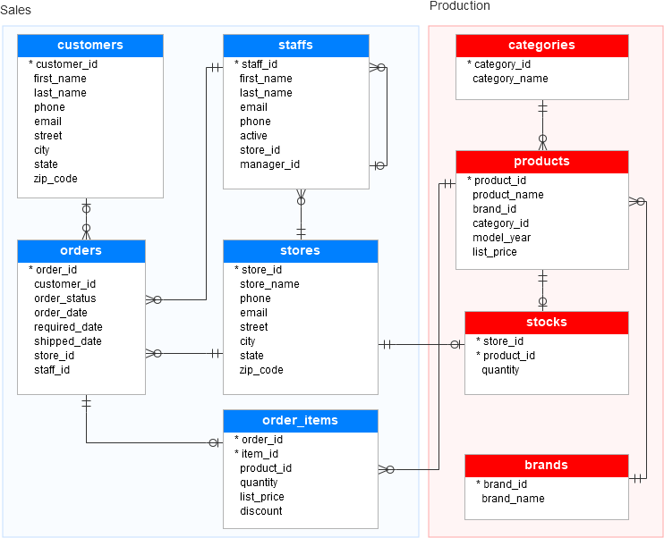

# 🚲 Bike Store Analysis using SQL

Exploratory analysis of a bike store database using **SQL Server (SSMS)**: customers, products, stores, orders, and inventory.


## 📌 Overview

This project answers business questions about a bike store by querying a relational database. The data was imported into SQL Server Management Studio (SSMS) after preprocessing, then analyzed with T-SQL.

**Dataset:** [Bike Store Sample Database (Kaggle)](https://www.kaggle.com/datasets/dillonmyrick/bike-store-sample-database)

## 🗂️ Database Schema



## 🔍 What I Analyzed

| Area | Questions answered |
|---|---|
| **Customers** | Where are customers located? How many orders does each customer place? |
| **Products** | What are the max, min, and average prices per category? |
| **Orders** | How many orders per customer? Order IDs and dates |
| **Inventory** | What is the stock quantity per product in each store? |
| **Categories** | Which products belong to each category, and at what price? |

## 📊 Key Findings

- **1,000+ customers** are located in the state of **New York**.
- **282 products** were priced below **5,000** during **2017–2019**.
- Stock levels were compared between **Store 1** and **Store 2**.
- Products were grouped by category to compare price ranges.

## 💻 Sample Queries

--Display customers name and the products they buy
SELECT concat(customers.first_name,' ' ,customers.last_name) AS C_fullname,
	   products.product_name
	   from customers
	   JOIN orders ON customers.customer_id=orders.customer_id
	   JOIN order_items ON orders.order_id=order_items.order_id
	   JOIN products ON order_items.product_id=products.product_id;

## ⚙️ How to Run

1. Clone the repository:
   ```bash
   git clone https://github.com/nadasami1/SQL-project.git
   ```
2. In SSMS, create a database named `BIKESTORE_DB`.
3. Import the tables: right-click the database → **Tasks** → **Import Flat Files**, and load each CSV from the dataset.
4. Open the SQL scripts from this repo and run them.

## 🛠️ Skills Demonstrated

`SQL Server` · `T-SQL` · `JOINs` · `GROUP BY & aggregations` · `Data exploration` · `Relational schema reading`

## 🏁 Conclusion

The queries give a clear picture of the store's operations: who the customers are, how they order, how products are priced across categories, and how stock is distributed between stores.

## 👤 Author

**Nada Sami Salem**
[LinkedIn](https://linkedin.com/in/nada-salem02) · [GitHub](https://github.com/nadasami1)
